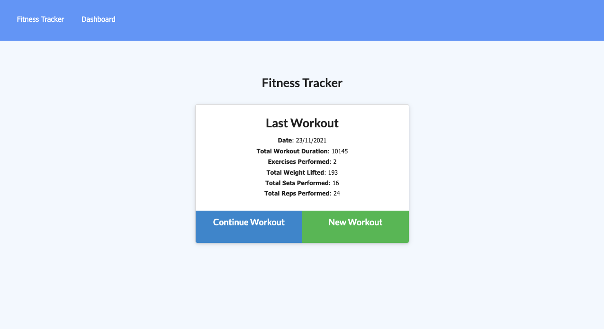
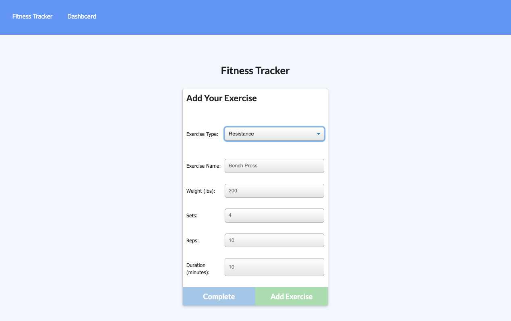
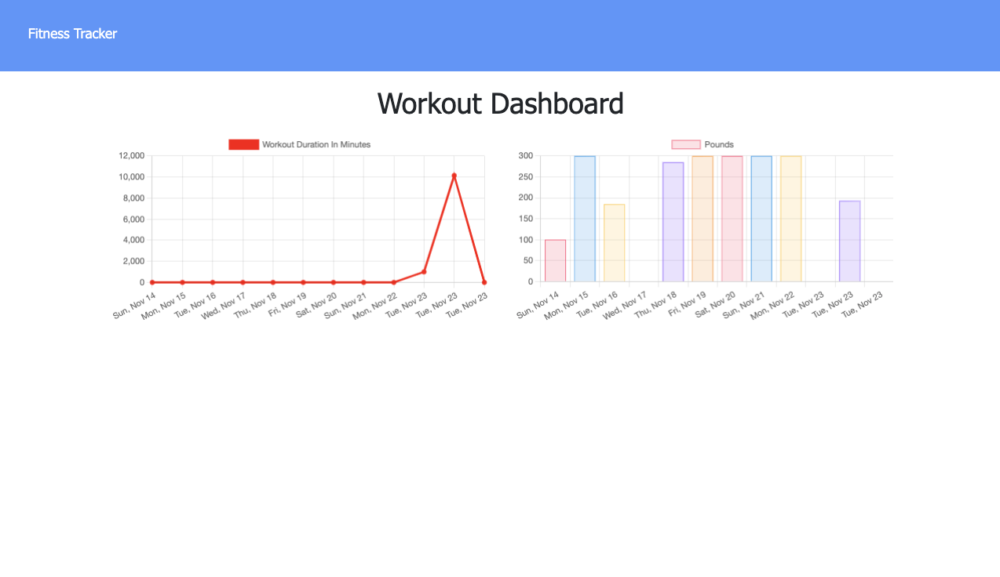

# Fitness Tracker

## Project Description
Fitness tracker to track your workouts! This application will keep track of your workouts, including all exercises! It'll display all your stats as well so you can see everything at a glance. 
## Table of Contents
* [Installation](#installation)  
* [Usage](#usage)
* [Contributions](#contributions)
* [Tests](#tests)
* [License](#license)
* [Questions](#questions)
## Installation 
To install this application, complete the following: 
1. Clone repository
2. Run 'npm install'
3. Run 'npm run seed'
4. Run 'npm run watch' 
5. Open application in browser via localhost:3000
## Usage
1. Homepage 

2. Adding exercise

3. Weekly summary 

## Tests 
No testing is available for this application.
## License
This project is licensed with the MIT license.
## Questions
GitHub username: [michaelshxw](http://www.github.com/michaelshxw)

For any questions or queries, please email me here: [michaelshxw@gmail.com](mailto:michaelshxw@gmail.com)